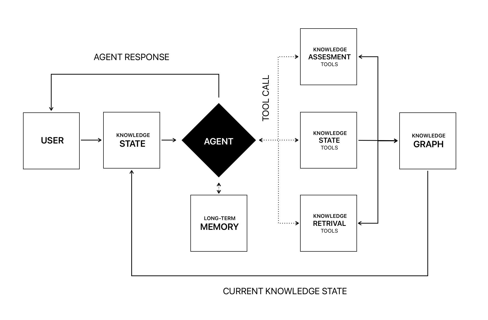
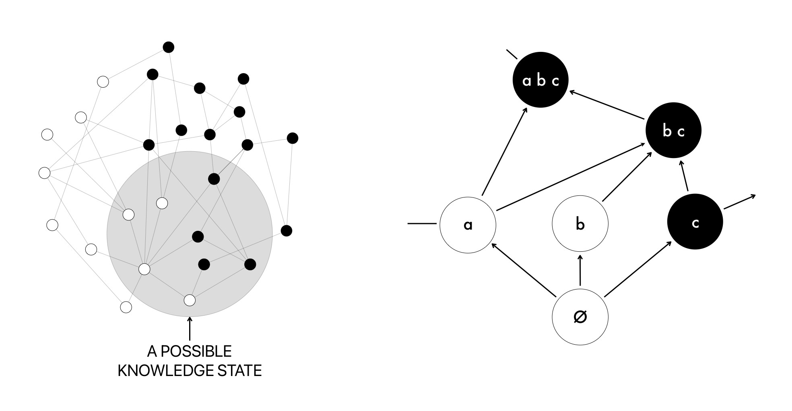

# MIPT Thesis: AI Agents for Personalized Learning

## Overview

This thesis investigates the integration of Large Language Models (LLMs) with Knowledge Graphs (KGs) to create adaptive AI-driven educational agents. Drawing on Knowledge Space Theory (KST), our system tailors explanations, exercises, and feedback based on a learner’s evolving knowledge state, ensuring that content delivery is context-aware and responsive to individual learning trajectories. The ultimate objective is to provide reliable, adaptive support that optimizes the educational experience by guiding learners through logically structured learning paths and personalized content curation.

## Data Sources

The system’s knowledge foundation is built from carefully curated machine learning resources:

- [**A Machine Learning Ontology (2023)**](https://osf.io/chu5q/): A structured ontology defining key concepts, algorithms, and relationships within the ML domain.
- [**Google’s Machine Learning Glossary**](https://developers.google.com/machine-learning/glossary): A comprehensive glossary that covers a broad range of machine learning terms, facilitating consistent and accurate conceptual definitions.

## Project Structure

```
├── data/
│   ├── glossary.csv
│   ├── ontology.owl
│   ├── schema.json
│   └── terms.txt
│
├── media/
│   ├── architecture.png
│   └── graph.png
│
├── notebooks/
│   ├── agents.ipynb
│   ├── experiments.ipynb
│   ├── langsmith.ipynb
│   └── parser.ipynb
│
├── pages/
│   ├── 1_Knowledge_State.py
│   ├── 2_Knowledge_Space.py
│   ├── 3_Persona_Bank.py
│   └── 4_Session_State.py
│
├── agent_one.py
├── prompts.py
├── README.md
├── requirements.txt
└── utils.py
```

**Key Directories:**

- **data/**: Contains primary datasets, ontologies, schemas, and raw terms.
- **media/**: Houses visual representations of system architecture and knowledge graph structures.
- **notebooks/**: Contains Jupyter notebooks for experimental evaluations, data parsing, and model development.
- **pages/**: Implements components for tracking the learner’s knowledge state, long-term memory, and session context management.

## System Architecture



**Figure 1:** The high-level architecture integrates a Large Language Model, a Knowledge Graph, and a long-term memory component, alongside supportive modules such as retrieval functions and evaluation prompts. The agent’s workflow involves:

1. **Interpretation of Learner Queries:** The LLM processes user inputs and identifies relevant topics.
2. **Dynamic Knowledge Graph Integration:** The agent consults and updates the Knowledge Graph to determine prerequisite concepts and tailor progression paths.
3. **Long-Term Memory Utilization:** The system retrieves and stores learner preferences, previous challenges, and performance metrics to ensure continuity and personalization over time.
4. **Context-Aware Content Generation:** The agent generates adaptive explanations, practice exercises, and feedback aligned with the learner’s current mastery level and interests.

## Knowledge Graph Structure



**Figure 2:** The Knowledge Graph is organized according to Knowledge Space Theory, where nodes represent concepts and directed edges denote prerequisite relationships. This hierarchical structure ensures that learners master fundamental concepts before progressing to more advanced material. By mapping the learner’s current knowledge state onto the graph, the system can select the most suitable next steps, ensuring pedagogically sound content delivery.

## Experiments

- **`notebooks/agents.ipynb`**: Contains experiments on agentic approaches, memory tools, and LLM reasoning.
- **`notebooks/experiments.ipynb`**: Demonstrates named entity recognition (NER) experiments, automated knowledge graph construction, and exploratory data analysis.
- **`notebooks/parser.ipynb`**: Focuses on parsing and refining raw data to populate and update the underlying Knowledge Graph.

These experiments form the empirical backbone of our approach, guiding the refinement of methodologies for better precision, adaptability, and robustness in the personalized learning pipeline.

## Contact

**Eduard Antonov**  
[antonov.ek@phystech.edu](mailto:antonov.ek@phystech.edu)

For inquiries, suggestions, or collaboration opportunities, please feel free to reach out.

## Acknowledgements

Thesis Supervisor: Olga Ataeva, Senior Researcher, Federal Research Center of the Russian Academy of Sciences (FRC CSC RAS).
